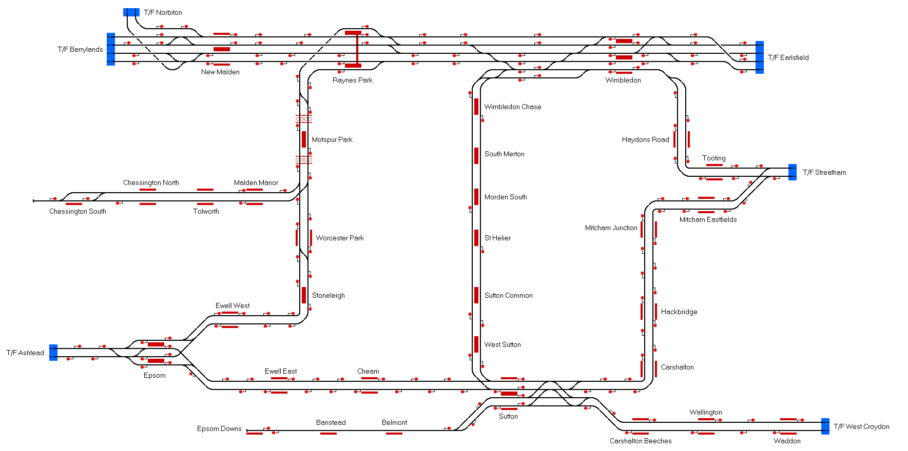

# Sutton, Epsom and Wimbledon
A route covering Sutton, Epsom and Wimbledon, designed to connect with several other routes.

## Current Status

| Stage         | Status        |
| ------------- |:-------------:|
| Track Plan     | :heavy_check_mark: |
| Signalling      | :heavy_check_mark:      |
| Naming | :heavy_check_mark:      |
| Speed Limits | :heavy_check_mark: |
| Distances | :heavy_check_mark: |
| Timetable | :x: |
| Documentation | :x: |

## Data Sources

- [OpenStreetMap](https://www.openstreetmap.org/#map=12/51.3776/-0.2115)
- [TRAKSY.UK](https://traksy.uk/live/M+23+DONC/M+9+SUTTON)
- [Meurisse](https://map.meurisse.org/)
